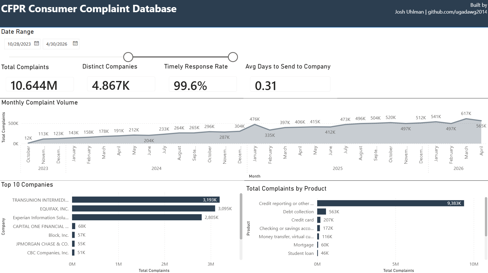

# CFPB Consumer Complaint Dashboard

A Power BI dashboard built on the U.S. Consumer Financial Protection Bureau's
public complaint database. Refreshes live from the CFPB Search API.

## What it does

- Tracks complaint volume, timeliness of company responses, and dispute rates
  across products, issues, companies, and states.
- Surfaces complaint patterns useful for consumer-protection compliance,
  fair-lending review, and competitive benchmarking.

## Dashboard preview

### Overview

## About the data

|---|---|
| **Source** | [CFPB Consumer Complaint Database](https://www.consumerfinance.gov/data-research/consumer-complaints/) |
| **Bulk download** | <https://files.consumerfinance.gov/ccdb/complaints.csv.zip> (~1.7 GB compressed, ~8.4 GB uncompressed) |
| **Update cadence** | CFPB refreshes the bulk file daily |
| **Window pulled** | ~5 years (cutoff configurable in `scripts/slice_complaints.py`) |
| **Row count** | ~12.8M complaints |
| **License** | Public domain (U.S. government work) |

## Tech stack

- **Power BI Desktop** (model + visuals)
- **Power Query / M** (live API ingestion, pagination, type coercion)
- **DAX** (measures for ratios, time-intelligence comparisons, rankings)

## Project structure
├── pbix/                  Power BI report (.pbix)
├── m-code/                Power Query M scripts (one per query)
├── dax/                   DAX measures, exported one per line
├── scripts/               Helper Python scripts (CSV slicing, etc.)
├── data/                  Local working data (gitignored; see data/README.md)
├── docs/                  Data model, findings, setup notes
├── screenshots/           Dashboard screenshots
├── LICENSE                CC0 1.0 Universal
└── README.md

## How to run it
See [docs/setup.md](docs/setup.md).

## Findings
See [docs/findings.md](docs/findings.md).

## License

This project is dedicated to the public domain under
[Creative Commons CC0 1.0 Universal](LICENSE). You may copy, modify,
distribute, and use the code freely — no attribution required. CFPB complaint
data is also in the public domain (U.S. government work).

## About
Portfolio project by Joshua Uhlman ([github.com/ugadawg2014](https://github.com/ugadawg2014)).
Built to demonstrate Power Query, DAX, and dashboard design skills relevant to
risk, compliance, and regulatory-reporting work in financial services.
